# 蔬菜类商品的自动定价与补货决策

> 基于 2020-07-01 至 2023-06-30 某商超销售流水、批发价格与损耗率数据的建模分析
> （数据来源：附件 1～4；问题背景：2023 高教社杯全国大学生数学建模竞赛 C 题）

---

## 摘要

生鲜商超的蔬菜类商品保鲜期短、隔日难售，必须在凌晨进货、信息不完全的条件下完成当日补货与定价决策。本文以某商超 6 个蔬菜品类、251 个单品三年（87.8 万条）的销售流水、批发价格与近期损耗率数据为基础，围绕**分布规律与关联关系、品类补货定价、单品补货定价、数据采集建议**四个问题，建立了一套"成本加成 + 需求驱动"的动态补货定价分析体系。

- **问题一**：通过描述统计、季节性分解、相关分析与 K-means 聚类，刻画了销量的分布规律与品类/单品间的关联关系。结果显示花叶类占全店销量的 **42.2%**；单品销量呈强烈右偏长尾分布（前 20% 单品贡献约 **83.9%** 销量）；销量存在显著的季节性与"周末高于工作日"（543 vs 391 kg/日）规律；各品类日销量普遍正相关（多数 0.5～0.69），其中**茄类相对独立**（与其他品类相关系数仅 0.07～0.31）。

- **问题二**：以对数线性需求模型 `lnQ = a + e·lnP + 月份 + 星期 + 趋势` 估计各品类的价格弹性，发现 6 个品类需求**均缺乏弹性**（|e|<1，介于 -0.24～-0.85）。在"利润 = 销量×(售价 − 损耗调整成本)"的目标下，于历史实际加成带内求最优加成率，给出了 2023-07-01～07-07 各品类的**日补货量与定价策略**，预计该周总利润约 **7013 元**。

- **问题三**：以 2023-06-24～30 实际在售的 **49** 个单品为候选，建立 0-1 整数规划（MILP），在"可售单品 27～33 个、单品订购量 ≥ 2.5 kg 最小陈列量、全品类覆盖"约束下最大化总利润，得到 7 月 1 日的 **33 个单品**补货量与定价方案，预计当日利润约 **806 元**。

- **问题四**：从库存与报废、单品级进价与到货、外部需求驱动因素、竞争与产地四个维度提出需补充采集的数据清单，并说明其对需求预测精度与优化决策质量的作用。

**关键词**：蔬菜定价；补货决策；价格弹性；成本加成；整数规划；需求预测

---

## 一、问题重述

生鲜商超中蔬菜类商品保鲜期短、品相随时间变差，当日未售出隔日多无法再售；进货在凌晨 3:00–4:00 完成，商家须在不确切知道单品与进价的情况下做出补货决策。蔬菜一般采用"成本加成定价"，对运损与品相变差商品打折销售。基于附件数据，需解决：

1. **问题一**：分析各品类及单品销售量的分布规律及相互关系。
2. **问题二**：以品类为单位，分析各品类销售总量与成本加成定价的关系，给出 2023-07-01～07-07 各品类**日补货总量与定价策略**，使收益最大。
3. **问题三**：在可售单品总数 27～33 个、各单品订购量满足最小陈列量 2.5 kg 的前提下，依据 2023-06-24～30 的可售品种，给出 7 月 1 日的**单品补货量与定价策略**，在尽量满足各品类需求下使收益最大。
4. **问题四**：为更好制定补货与定价决策，还需采集哪些数据，这些数据有何帮助。

---

## 二、整体研究思路

本文的整体研究思路框架如图 0 所示：以四份附件为数据源，经统一的数据预处理与特征构建后，分别针对四个问题建立相应模型，各问题结论最终汇聚为面向商超的补货与定价决策建议。

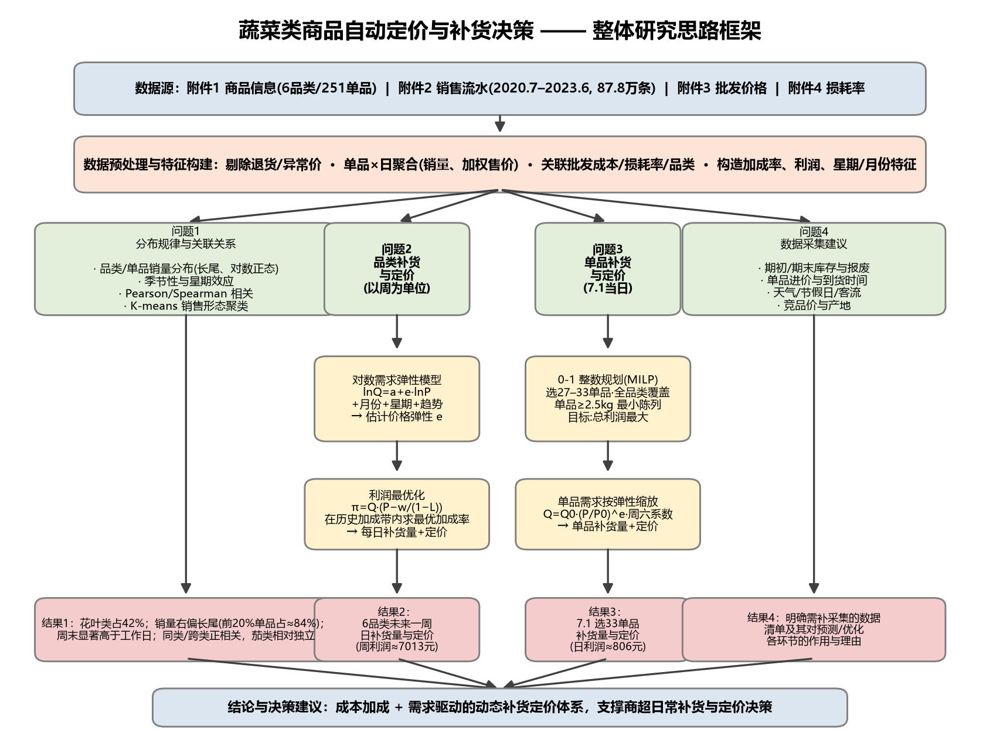

<b>图 0　整体研究思路框架图</b>

---

## 三、模型假设与符号说明

### 3.1 基本假设

1. 蔬菜当日未售出即报废，无跨日库存（符合题目"隔日无法再售"的描述）。
2. 附件 4 给出的损耗率反映近期稳定的运损与品相损耗水平，短期内对同一单品可视为常数。
3. 同一品类、同一时段内，需求对价格的响应可由不变价格弹性近似描述。
4. 未来一周的批发成本与近 30 天的水平接近（以近期均值作为成本预测）。
5. 退货与异常记录占比极低（退货仅 461 条，占 0.05%），对总体规律不构成实质影响。

### 3.2 符号说明

| 符号 | 含义 |
|---|---|
| $Q$ | 日销量（kg） |
| $P$ | 零售单价（元/kg） |
| $w$ | 批发成本（元/kg） |
| $L$ | 损耗率 |
| $r$ | 成本加成率，$P=w(1+r)$ |
| $e$ | 价格弹性，$e=\partial \ln Q/\partial \ln P$ |
| $\pi$ | 利润（元） |
| $y_i$ | 单品 $i$ 是否入选（0-1 变量） |

---

## 四、数据预处理与特征构建

原始数据规模与清洗要点：

- **附件 2 销售流水**：878,503 条，时间跨度 2020-07-01 至 2023-06-30。其中销售 878,042 条、退货 461 条、打折销售 47,366 条。将退货记为负销量后按"单品×日"聚合，得到 **46,595** 条单品日记录。
- **附件 3 批发价格**：55,982 条，按日期+单品关联到销售记录，得到每条单品日记录的成本。
- **附件 1 商品信息**：6 个品类、251 个单品。各品类单品数：花叶类 100、食用菌 72、辣椒类 45、水生根茎类 19、茄类 10、花菜类 5。
- **附件 4 损耗率**：251 个单品，平均损耗率 9.43%。

构建的关键特征：销量、加权售价（=销售额/销量）、成本加成率 $r=P/w-1$、利润、星期、月份、时间趋势。品类层面按销量加权汇总成本、售价与损耗率。

---

## 五、问题一：销量分布规律与关联关系

### 5.1 品类销量分布与占比

各品类总销量与占比如图 1 所示。**花叶类**销量最大（198,522 kg，占 **42.2%**），其次为辣椒类（19.4%）、食用菌（16.2%）；花菜类、茄类销量最小（占比 < 9%）。值得注意的是，花菜类仅 5 个单品却贡献 8.9% 的销量，单品平均贡献最高。

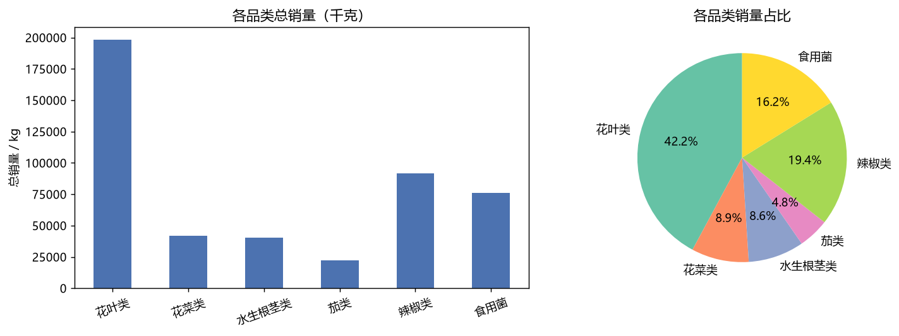

<b>图 1　各品类总销量（左）与销量占比（右）</b>

### 5.2 时间分布：季节性与星期效应

各品类月销量时间序列（图 2）显示明显的**年度季节性与节假日波动**；按月汇总并归一化后的季节性曲线（图 3）表明：多数品类在春节前后及夏秋季出现销量高峰，符合"供应品种 4–10 月较丰富"的供给侧特征。

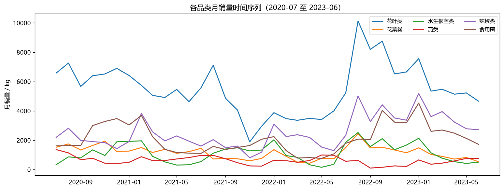

<b>图 2　各品类月销量时间序列（2020-07 至 2023-06）</b>

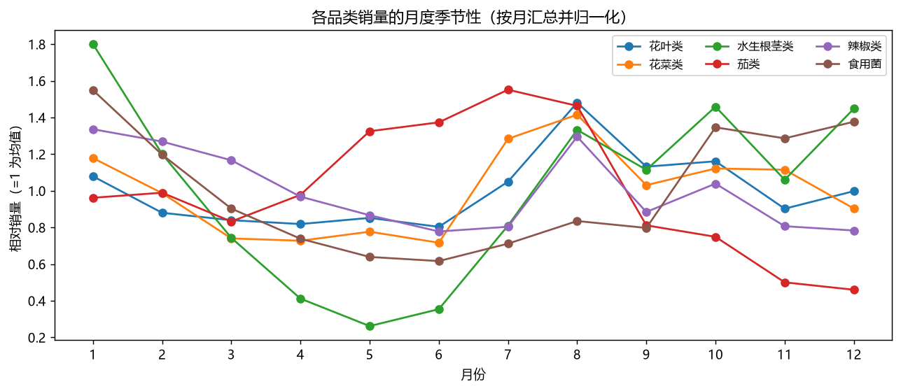

<b>图 3　各品类销量的月度季节性（归一化）</b>

星期效应显著（图 4）：周末平均日销量 **543.4 kg**，明显高于工作日的 **390.5 kg**（约高 39%）。这一规律是后续补货量预测中引入"星期"特征的依据。

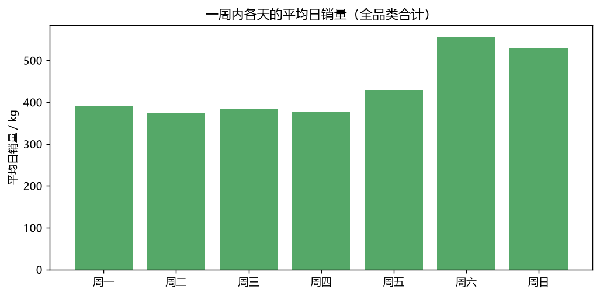

<b>图 4　一周内各天的平均日销量</b>

### 5.3 单品销量分布：长尾与集中度

单品总销量呈强烈右偏的长尾分布（图 5 左），近似对数正态。集中度曲线（图 5 右）表明：**销量前 10 的单品贡献 39.1% 的销量，前 20% 的单品贡献约 83.9%**，符合典型的"二八法则"，为问题三中"少量单品支撑主要销量"的选品策略提供依据。

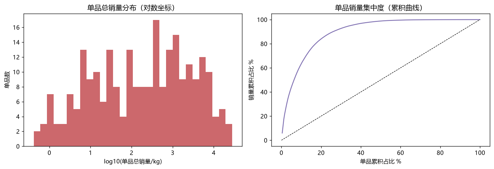

<b>图 5　单品总销量分布（左：对数坐标）与集中度累积曲线（右）</b>

销量前 10 的单品如下表：

| 排名 | 单品 | 品类 | 总销量(kg) |
|---|---|---|---|
| 1 | 芜湖青椒(1) | 辣椒类 | 28,164 |
| 2 | 西兰花 | 花菜类 | 27,537 |
| 3 | 净藕(1) | 水生根茎类 | 27,149 |
| 4 | 大白菜 | 花叶类 | 19,187 |
| 5 | 云南生菜 | 花叶类 | 15,911 |
| 6 | 金针菇(盒) | 食用菌 | 15,596 |
| 7 | 云南生菜(份) | 花叶类 | 14,325 |
| 8 | 紫茄子(2) | 茄类 | 13,602 |
| 9 | 西峡香菇(1) | 食用菌 | 11,920 |
| 10 | 小米椒(份) | 辣椒类 | 10,833 |

### 5.4 品类间关联关系

各品类日销量的 Pearson 相关系数矩阵如图 6。多数品类之间呈**中等偏强的正相关**（0.52～0.69），反映顾客倾向于"一次性采购多类蔬菜"的关联消费；而**茄类与其他品类相关性最弱**（0.07～0.31），销售相对独立，提示其补货可相对解耦。

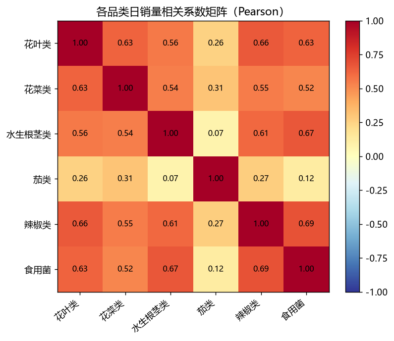

<b>图 6　各品类日销量相关系数矩阵（Pearson）</b>

### 5.5 单品间关联关系

对销量前 30 的单品计算日销量相关矩阵（图 7）。强正相关的单品对多为同属"净菜/份装"的叶菜，例如**云南生菜(份)–云南油麦菜(份)（0.84）**、云南生菜(份)–小皱皮(份)（0.77）、小米椒(份)–金针菇(盒)（0.74），体现联合采购的互补关系；而同一蔬菜的不同供应来源（如"云南生菜"散称与"云南生菜(份)"份装）呈**负相关（-0.56）**，体现明显的替代关系。

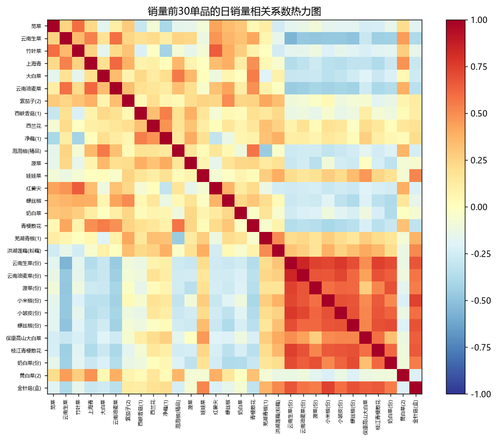

<b>图 7　销量前 30 单品的日销量相关系数热力图</b>

### 5.6 单品销售形态聚类

以单品月度销量占比为特征进行 K-means 聚类（k=4，图 8），将 158 个活跃单品划分为四类不同的季节形态：**全年平稳型（98 个，占多数）、夏秋主销型、冬春主销型、节令集中型**。聚类结果为差异化补货（平稳型可长期备货，季节型按时令调整）提供依据。

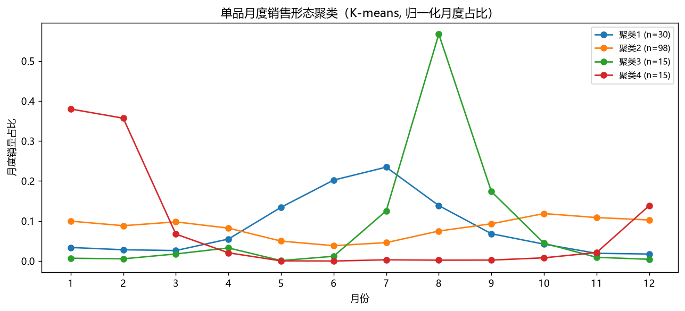

<b>图 8　单品月度销售形态聚类（K-means）</b>

---

## 六、问题二：品类补货量与定价策略

### 6.1 销售总量与成本加成定价的关系

成本加成定价下 $P=w(1+r)$，销量随售价（即随加成率）变化。对每个品类建立**对数线性需求模型**，并以月份、星期与时间趋势控制季节与趋势效应：

$$\ln Q_t = a + e\,\ln P_t + \sum_m \beta_m \mathbb{1}[\text{month}=m] + \sum_d \gamma_d \mathbb{1}[\text{dow}=d] + \delta\, t + \varepsilon_t$$

其中 $e$ 即价格弹性。各品类估计结果：

| 品类 | 价格弹性 e | 模型 $R^2$ |
|---|---|---|
| 花叶类 | -0.845 | 0.466 |
| 花菜类 | -0.832 | 0.302 |
| 水生根茎类 | -0.355 | 0.607 |
| 茄类 | -0.242 | 0.506 |
| 辣椒类 | -0.539 | 0.464 |
| 食用菌 | -0.783 | 0.427 |

各品类加成率与销量的散点及拟合需求曲线见图 9。结论：**6 个品类需求均缺乏弹性（|e|<1）**——价格上升时销量下降幅度小于价格上升幅度，因此在合理区间内适当提高加成率有利于增加利润；其中茄类、水生根茎类弹性最低（最"刚需"），花叶类、花菜类相对敏感。

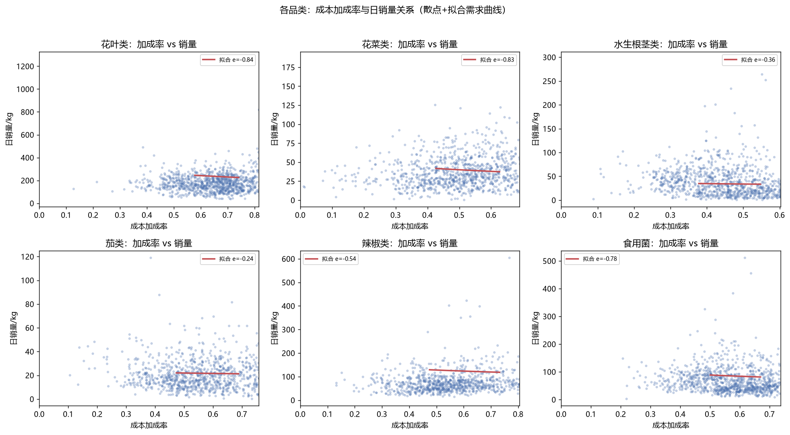

<b>图 9　各品类成本加成率与日销量关系（散点 + 拟合需求曲线）</b>

### 6.2 收益最大化模型

考虑损耗：欲售出 $Q$ kg 须进货 $Q/(1-L)$ kg。给定售价 $P$、批发成本 $w$、损耗率 $L$，单日利润为

$$\pi(P) = Q(P)\cdot P - \frac{Q(P)}{1-L}\cdot w = Q(P)\left(P - \frac{w}{1-L}\right),\qquad Q(P)=K\,P^{e}$$

由于各品类需求缺乏弹性，无约束最优为角点解，故将加成率约束在**历史实际经营区间 [P25, P75]** 内数值寻优，以保证方案可落地。成本 $w$ 与损耗 $L$ 取近 30 天均值；需求基线 $K$ 由模型预测（取 7 月、对应星期）。

### 6.3 求解结果：2023-07-01～07-07 日补货量与定价

最优加成率与对应的每日补货量见下表（完整逐日明细见 `analysis/q2_plan.csv`）：

| 品类 | 成本(元/kg) | 损耗率 | 最优加成率 | 定价(元/kg) | 周补货量(kg) | 周利润(元) |
|---|---|---|---|---|---|---|
| 花叶类 | 3.41 | 10.5% | 74.0% | 5.94 | 1,364.0 | 2,592.7 |
| 辣椒类 | 3.52 | 8.8% | 73.1% | 6.10 | 700.1 | 1,428.5 |
| 食用菌 | 3.49 | 1.8% | 66.9% | 5.82 | 440.0 | 981.4 |
| 花菜类 | 9.42 | 9.4% | 62.7% | 15.32 | 219.8 | 981.8 |
| 水生根茎类 | 11.13 | 16.1% | 54.7% | 17.23 | 201.9 | 668.9 |
| 茄类 | 4.94 | 6.3% | 68.8% | 8.35 | 125.2 | 360.2 |
| **合计** | — | — | — | — | **3,051.0** | **7,013.5** |

各品类每日补货量（含周末上浮）见图 10。可见花叶类、辣椒类为补货主力，且周末（7/1、7/2）补货量明显高于工作日，与问题一发现的星期效应一致。

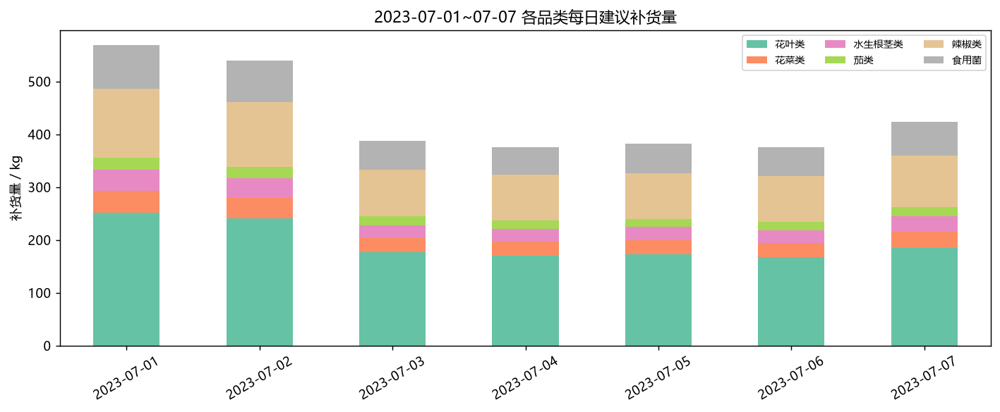

<b>图 10　2023-07-01～07-07 各品类每日建议补货量</b>

---

## 七、问题三：单品补货量与定价策略（2023-07-01）

### 7.1 候选单品与需求估计

以 **2023-06-24～30 实际在售**的单品作为 7 月 1 日可售候选，共 **49** 个。对每个候选单品：

- 成本 $w_i$ 取 7 月 1 日前最近的批发价；损耗率 $L_i$ 取附件 4；
- 以候选周内的日均销量为基准，乘以**周六上浮系数**（7 月 1 日为周六）；
- 定价沿用问题二各品类的推荐加成率，并据品类价格弹性把需求从历史价位缩放到新价位：$Q_i = Q_{i,0}\cdot(P_i/P_{i,0})^{e_{\text{cat}}}\cdot s_{\text{Sat}}$。

### 7.2 选品与补货的整数规划（MILP）

设 $y_i\in\{0,1\}$ 表示单品 $i$ 是否入选，单品入选后的利润 $\pi_i$ 在"订购量 $o_i=\max(Q_i/(1-L_i),\,2.5)$、可售量 $o_i(1-L_i)$、实际售出 $\min(o_i(1-L_i),Q_i)$"下计算（最小陈列量导致低需求单品被迫备货 2.5 kg，超出部分计入报废）。优化模型：

$$\max_{y}\ \sum_i \pi_i\,y_i \quad\text{s.t.}\quad 27\le\sum_i y_i\le 33,\quad \sum_{i\in \text{cat }c} y_i\ge 1\ (\forall c)$$

即在选 27～33 个单品、**全部 6 个品类均被覆盖**（尽量满足各品类市场需求）的约束下最大化总利润。模型用 CBC 求解。

### 7.3 求解结果

最优方案选出 **33** 个单品（取上限以充分利用销售空间），各品类入选数：花叶类 12、辣椒类 8、水生根茎类 4、食用菌 4、茄类 3、花菜类 2。**预计 7 月 1 日总进货 377.8 kg，总利润约 806.2 元**。各单品补货量（按品类着色）见图 11，完整方案见 `analysis/q3_plan.csv`，节选如下：

| 单品 | 品类 | 成本 | 损耗率 | 定价 | 预计需求(kg) | 补货量(kg) | 利润(元) |
|---|---|---|---|---|---|---|---|
| 云南生菜(份) | 花叶类 | 3.49 | 9.4% | 6.07 | 31.9 | 35.2 | 70.8 |
| 西峡花菇(1) | 食用菌 | 15.60 | 10.8% | 26.04 | 5.6 | 6.2 | 47.6 |
| 小米椒(份) | 辣椒类 | 2.11 | 9.4% | 3.65 | 35.2 | 38.8 | 46.5 |
| 云南油麦菜(份) | 花叶类 | 2.84 | 9.4% | 4.94 | 23.6 | 26.1 | 42.6 |
| 螺丝椒 | 辣椒类 | 8.97 | 10.2% | 15.53 | 7.4 | 8.3 | 41.1 |
| 净藕(1) | 水生根茎类 | 10.38 | 5.5% | 16.06 | 7.4 | 7.9 | 37.6 |
| 娃娃菜 | 花叶类 | 4.40 | 2.5% | 7.66 | 11.7 | 12.0 | 36.8 |
| 紫茄子(2) | 茄类 | 3.43 | 6.1% | 5.79 | 14.1 | 15.0 | 30.2 |
| … | … | … | … | … | … | … | … |

> 对预计需求不足 2.5 kg 的单品（如云南生菜、菱角、红椒(2) 等），补货量被最小陈列量抬升至 2.5 kg，体现了陈列约束与报废之间的权衡。

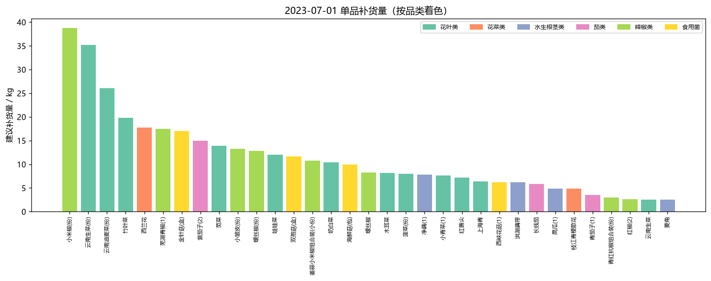

<b>图 11　2023-07-01 单品补货量（按品类着色）</b>

---

## 八、问题四：建议补充采集的数据

为提升补货与定价决策质量，建议在现有数据基础上补充采集以下四类数据：

| 类别 | 具体数据 | 对解决问题的帮助 |
|---|---|---|
| **库存与报废** | 每日期初/期末库存、实际报废量、打折时点与折扣率 | 现有数据只含售出量，无法区分"需求"与"卖断货/报废"。有了库存与报废，可还原**真实需求**（去除缺货截断），显著提升问题二、三的需求预测与补货量精度，并直接量化损耗成本。 |
| **单品级进价与到货** | 单品当日实际进价、到货时间与到货量、起订量/箱规 | 题目假设凌晨进货时不知具体进价；采集后可把问题二、三中"成本取近期均值"的近似替换为**真实成本**，使加成定价更准确，并使最小陈列/起订约束更贴合实际。 |
| **外部需求驱动** | 天气、节假日、促销活动、门店客流、周边竞品价格 | 销量受天气、节假日、客流强烈影响（问题一已见显著星期与季节效应）。纳入这些变量可把需求模型从"时间外推"升级为**因果/驱动型预测**，提升异常日（如节前）的预测能力。 |
| **竞争与产地** | 竞品同类售价、产地与运输距离、品质等级 | 价格弹性估计存在内生性（价高同时品质高）。竞品价与品质等级可作为工具变量/控制变量，**更准确地识别真实价格弹性**，从而给出更优的加成定价。 |

**总体而言**：当前数据缺少"需求的真实值（受库存/报废截断）"与"成本的真实值（进价未知）"两项关键信息，补齐后可将本文的"成本近似 + 销量近似"框架升级为基于真实需求与真实成本的精细化决策系统。

---

## 九、模型评价与改进方向

**优点**：
1. 建立了从数据预处理到四问求解的统一框架，问题二、三结论相互衔接（问题三的定价与需求缩放直接沿用问题二的弹性与加成率）。
2. 需求模型显式控制季节、星期与趋势，并以历史经营区间约束加成率，结论可落地。
3. 问题三采用整数规划严格满足"27–33 单品、≥2.5 kg、全品类覆盖"的业务约束。

**不足与改进**：
1. 价格弹性估计存在内生性，未来可引入工具变量或面板固定效应改进；
2. 成本与需求基线均用近期均值近似，可替换为 ARIMA/Prophet/LightGBM 等时序预测；
3. 单品需求由品类弹性近似，数据充足时可对高销量单品单独建模；
4. 未显式建模缺货截断，结合问题四的库存数据可进一步提升。

---

## 附录：代码与数据

- 数据加载与预处理：`analysis/common.py`
- 问题一：`analysis/q1.py`（产出 `q1_results.json` 及图 1–8）
- 问题二：`analysis/q2.py`（产出 `q2_results.json`、`q2_plan.csv` 及图 9–10）
- 问题三：`analysis/q3.py`（产出 `q3_results.json`、`q3_plan.csv` 及图 11）
- 思路框架图：`analysis/framework.py`（产出 `paper/framework.png`）
- 全部图表位于 `paper/figures/`。
